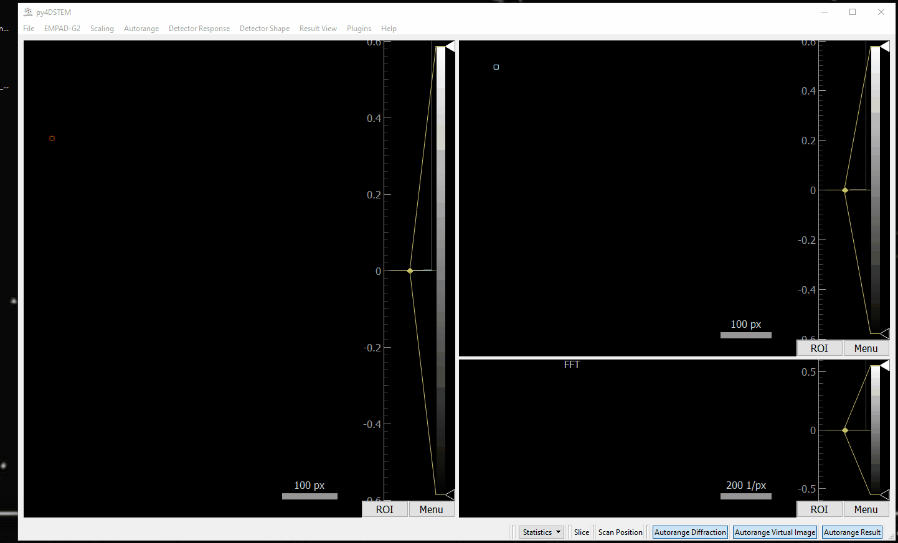

# py4D-browser-fast-acbf

`py4D-browser-fast-acbf` wires
[fast-acbf](https://github.com/chiahao3/fast-acbf) into
[py4D-browser](https://github.com/sezelt/py4D-browser) as a plugin for
GPU-accelerated tcBF and acBF reconstruction. The plugin builds a
`fast_acbf.solver.BFSolver` from the current py4D-browser datacube, uses CUDA
when available, then MPS on Apple Silicon, and falls back to CPU.

## Installation

`fast-acbf` and this py4D-browser plugin are not published on PyPI yet, so
install them from source. Download both source archives from the Muller group
GitHub hosted by Cornell, unzip them, then install both packages into the same
Miniforge/Conda environment that runs py4D-browser:

```bash
conda create -n py4dgui python=3.12
conda activate py4dgui
pip install -e /path/to/fast-acbf
pip install -e /path/to/py4D-browser-fast-acbf
```

## Usage

Start py4D-browser:

```bash
py4dgui
```

After loading a 4D datacube, open **Plugins > fast-acbf**. The flyout contains:

- **Interactive Dashboard**: opens the live dashboard for calibration,
  optics/orientation overrides, reconstruction previews, automated refinement,
  and refinement history.
- **Configuration**: edits fast-acbf physics, device, reconstruction, output,
  orientation, aberration, and refinement settings.



## Dashboard

The dashboard is the main workflow surface. It shows the current global
calibration, a Display mode selector, reconstruction and probe-amplitude image
panels, and a compact refinement history.

Display and refinement are intentionally separate:

- **Display mode** controls the image reconstructed after each run or
  refinement (`tcBF` or `acBF`).
- **Refinement mode** controls the mode passed to fast-acbf refinement methods.

This means a common workflow is supported directly: refine parameters in `tcBF`
for speed/stability, then display the updated result in `acBF`.

Dashboard actions:

- **Update and Preview** applies the current optics/orientation overrides and
  reconstructs using Display mode. The history step is recorded as `manual`.
- **Refine All Params** calls `BFSolver.refine_all_params(...)` directly.
- **Refine Flips** calls `BFSolver.refine_flips(...)` directly.
- **Refine Scan Rotation** calls `BFSolver.refine_scan_rotation(...)` directly.
- **Refine Defocus** calls `BFSolver.refine_defocus(...)` directly.
- **Refine Aberrations** calls `BFSolver.refine_aberrations(...)` directly.
- **Zero All** resets displayed aberration coefficients to zero.
- **Reset Orientation** resets scan rotation, `flipud`, `fliplr`, and
  `transpose`.

The dashboard history records the step, selected low-order aberration values,
rotation, and the scalar quality metric value.

The reconstruction and probe-amplitude panels both use real-space scale bars
based on the scan step.

## Configuration

The Configuration dialog is organized into Run, Physics, Optics, Orientation,
and Refinement tabs.

- **Run** selects Display mode, acBF algorithm, output target, output frame,
  upscale settings, optional padding, device, cache mode, chunk size, and acBF
  reconstruction parameters.
- **Physics** controls calibration-derived or manually-entered max alpha, scan
  step, reciprocal pixel size, voltage, wavelength, and max aberration order.
- **Optics** edits aberration coefficients and includes **Zero All**.
- **Orientation** edits scan rotation, `flipud`, `fliplr`, and `transpose`, and
  includes **Reset Orientation**.
- **Refinement** selects refinement mode, quality metric, defocus search
  settings, coarse rotation points for **Refine All Params**, local scan
  rotation range/half-width/points for explicit scan-rotation refinement, and
  aberration optimizer settings.

By default the plugin reads py4D-browser calibration for scan step, reciprocal
pixel size, and accelerating voltage. If a circular diffraction detector ROI is
active, it can also infer the collection semiangle from that ROI. Otherwise,
set max alpha, scan step, `dk`, and voltage/wavelength manually in
Configuration. The **Edit Calibration...** button opens the py4D-browser
calibration dialog with the current calibration values pre-filled; when the
dialog closes, the dashboard calibration display is refreshed.

## Output

Reconstruction results are sent back to py4D-browser as either:

- the virtual image, or
- the result image, if selected and supported by the running py4D-browser build.

The output image is reconstructed in Display mode. Refinement methods may run in
a different Refinement mode.

The `zero_insert` upscale method is the default for tcBF in fast-acbf 0.6.0.
It requires an integer upscale factor and is not supported by acBF. When either
Display mode or Refinement mode is acBF, the plugin uses `nearest` by default
and disables or coerces incompatible `zero_insert` selections.

## Device Selection

Set Device to:

- `auto`: choose CUDA if available, then MPS if available, otherwise CPU.
- `cuda`: force CUDA.
- `mps`: force Apple Silicon MPS.
- `cpu`: force CPU.

If a cached solver exists and the solver-signature settings have not changed,
the plugin reuses it. Changing physical solver inputs, max aberration order,
device, cache mode, phase epsilon, padding, or upscale settings rebuilds the
solver.

## License

GNU GPLv3
